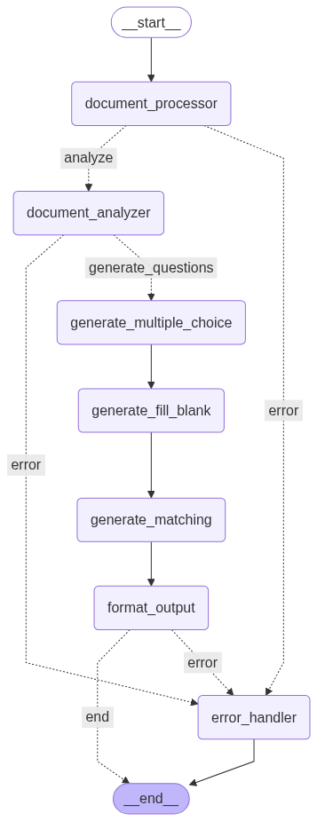

# AI教育题目生成系统

基于LangGraph和通义千问的智能教育题目生成应用，能够自动从教学文档中生成选择题、填空题和连线题。

## 🌟 功能特性

- **多种题型支持**：自动生成选择题、填空题、连线题
- **智能文档分析**：提取关键知识点和主题
- **模块化设计**：基于LangGraph的工作流架构
- **多LLM支持**：优先使用通义千问，支持OpenAI作为备选
- **结构化输出**：JSON格式便于后续处理和可视化
- **质量验证**：内置题目质量检查机制
- **图结构可视化**：支持查看和保存LangGraph工作流结构图

## 🏗️ 项目结构

```
lllm-QAs/
├── main.py                          # 主程序入口
├── config.py                        # 配置管理
├── llm_service.py                   # LLM服务封装
├── question_generator_graph.py      # LangGraph工作流
├── requirements.txt                 # 项目依赖
├── README.md                       # 项目说明
├── schemas/                        # 数据模型定义
│   ├── __init__.py
│   └── question_models.py
├── prompts/                        # Prompt模板
│   ├── __init__.py
│   └── question_prompts.py
└── nodes/                          # LangGraph节点
    ├── __init__.py
    ├── document_processor.py       # 文档处理节点
    ├── analyzer.py                 # 文档分析节点
    ├── question_generators.py      # 题目生成节点
    └── output_formatter.py         # 输出格式化节点
```

## 🚀 快速开始

### 1. 安装依赖

```bash
pip install -r requirements.txt
```

### 2. 配置API密钥

创建 `.env` 文件并配置API密钥：

```env
# 通义千问API配置
ALI_API_KEY=your_ali_api_key_here

# OpenAI API配置 (备选方案)
OPENAI_API_KEY=your_openai_api_key_here
OPENAI_BASE_URL=https://api.openai.com/v1
```

或者直接在 `config.py` 中修改配置。

### 3. 运行示例

```bash
# 使用示例文档快速体验
python main.py --sample

# 处理自定义文档
python main.py --file your_document.md --output questions.json

# 查看系统信息
python main.py --info
```

## 📖 使用方法

### 命令行参数

- `--file, -f`: 输入文档文件路径
- `--output, -o`: 输出文件路径
- `--title, -t`: 文档标题（用于文本输入）
- `--content, -c`: 文档内容（用于文本输入）
- `--sample, -s`: 创建并使用示例文档
- `--info`: 显示系统信息
- `--graph`: 显示图结构信息（ASCII和Mermaid）
- `--save-graph DIR`: 保存图结构可视化文件到指定目录

### 使用示例

```bash
# 1. 处理Markdown文档
python main.py --file lesson.md --output questions.json

# 2. 直接输入文本内容
python main.py --title "Python基础" --content "Python是一种编程语言..." --output python_questions.json

# 3. 使用示例文档测试
python main.py --sample --output sample_output.json

# 4. 查看图结构
python main.py --graph

# 5. 保存图结构可视化文件
python main.py --save-graph ./graph_output
```

### 编程接口

```python
from main import QuestionGeneratorApp

# 创建应用实例
app = QuestionGeneratorApp()

# 从文件生成题目
result = await app.generate_from_file("document.md", "output.json")

# 从文本生成题目
result = await app.generate_from_text("标题", "内容", "output.json")

# 检查结果
if result["success"]:
    print("生成成功！")
    print(result["output"])
else:
    print(f"生成失败：{result['error']}")
```

## 🔧 配置说明

在 `config.py` 中可以调整以下配置：

```python
# 模型配置
default_model: str = "qwen-plus"  # 通义千问模型
backup_model: str = "gpt-3.5-turbo"  # 备选OpenAI模型

# 生成配置
max_questions_per_type: int = 5  # 每类题目最大数量
temperature: float = 0.7  # 生成随机性
max_tokens: int = 2000  # 最大token数
```

## 📊 输出格式

生成的JSON文件包含以下结构：

```json
{
  "metadata": {
    "document_title": "文档标题",
    "generated_at": "2024-01-01T12:00:00",
    "statistics": {
      "total_questions": 15,
      "multiple_choice_count": 5,
      "fill_in_the_blank_count": 5,
      "matching_count": 5
    },
    "validation": {
      "valid": true,
      "quality_score": 0.95,
      "issues": []
    }
  },
  "questions": {
    "multiple_choice": [...],
    "fill_in_the_blank": [...],
    "matching": [...]
  },
  "document_analysis": {
    "topics": ["主题1", "主题2"],
    "key_points": ["要点1", "要点2", ...]
  }
}
```

## 🎯 题目类型

### 选择题 (Multiple Choice)
- 4个选项（A、B、C、D）
- 唯一正确答案
- 包含答案解释

### 填空题 (Fill-in-the-Blank)
- 1-3个空白处
- 支持提示信息
- 标准答案验证

### 连线题 (Matching)
- 4-6对匹配项
- 概念与定义的匹配
- 一对一的匹配关系

## 🔄 工作流程

系统采用LangGraph构建的工作流：



*上图展示了完整的LangGraph工作流结构，包括各个处理节点、条件分支和错误处理机制*

1. **API连接测试**：自动测试API密钥有效性和网络连接
2. **文档处理**：解析Markdown文档，清理格式
3. **文档分析**：提取主题和关键知识点
4. **题目生成**：
   - 生成选择题
   - 生成填空题
   - 生成连线题
5. **输出格式化**：验证题目质量，生成JSON输出

### 🔧 API连接测试

系统在启动时会自动进行API连接测试：
- ✅ 如果通义千问API可用，将优先使用
- ⚠️ 如果通义千问不可用，会自动切换到OpenAI备选方案
- ❌ 如果所有API都不可用，程序会提前退出并给出解决建议

## 🛠️ 扩展开发

### 添加新题型

1. 在 `schemas/question_models.py` 中定义新的题目模型
2. 在 `prompts/question_prompts.py` 中添加对应的Prompt模板
3. 在 `nodes/question_generators.py` 中实现生成器节点
4. 在 `question_generator_graph.py` 中添加到工作流

### 自定义LLM

在 `llm_service.py` 中添加新的LLM提供商支持：

```python
def _create_custom_llm(self):
    # 实现自定义LLM
    pass
```

## 🐛 故障排除

### 常见问题

1. **API连接失败**
   - 检查 `ALI_API_KEY` 环境变量是否正确设置
   - 确认API密钥有足够的额度和权限
   - 检查网络连接是否正常
   - 如果通义千问不可用，尝试设置 `OPENAI_API_KEY` 作为备选

2. **依赖安装失败**
   - 使用Python 3.8+版本
   - 尝试使用虚拟环境
   - 更新pip: `pip install --upgrade pip`

3. **题目质量不佳**
   - 调整 `temperature` 参数
   - 优化Prompt模板
   - 检查输入文档质量

4. **初始化失败**
   - 查看图结构验证系统: `python main.py --graph`
   - 检查所有依赖是否正确安装
   - 查看详细错误信息进行排查

### 日志调试

系统会生成 `question_generation.log` 日志文件，包含详细的运行信息。

## 📝 许可证

MIT License

## 🤝 贡献

欢迎提交Issue和Pull Request来改进这个项目！

## 📞 联系方式

如有问题或建议，请通过GitHub Issue联系。 